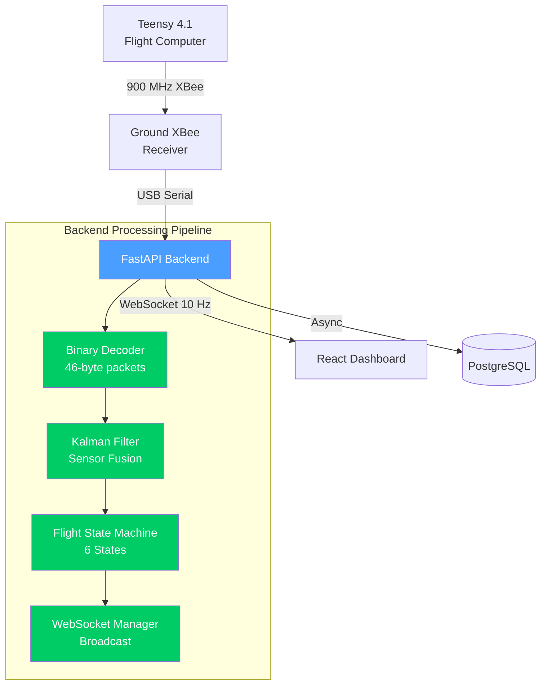
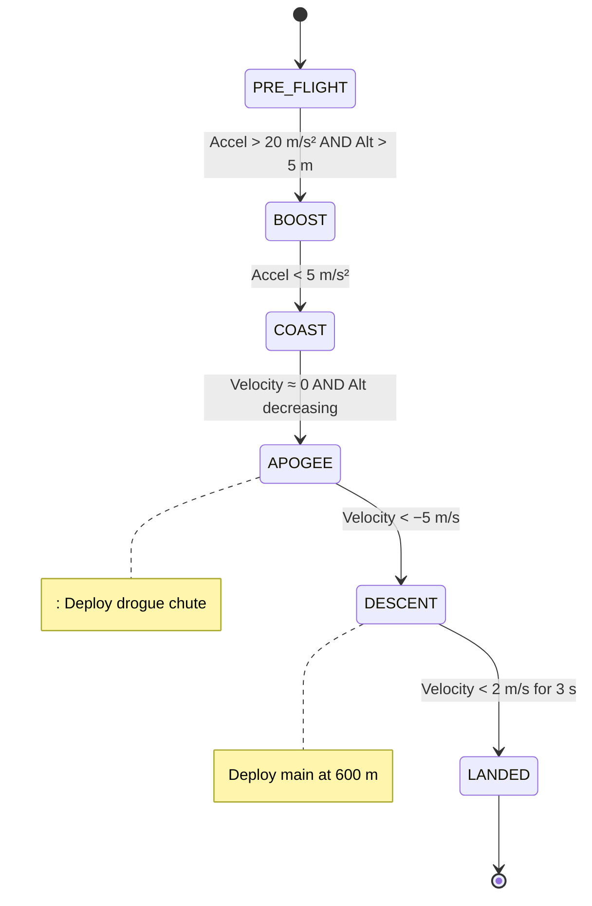
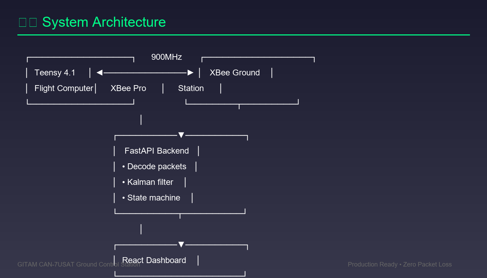
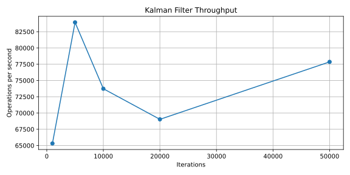
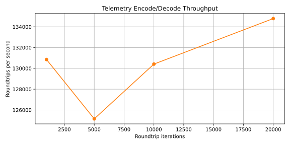
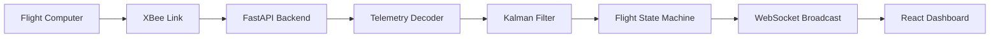
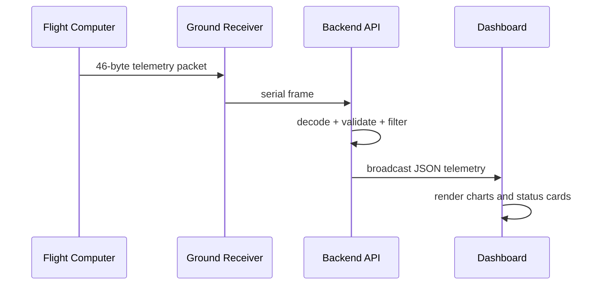

# CAN-7USAT Ground Control Station

> Real-time telemetry ground control system for the IN-SPACe Model Rocketry Competition 2026.  
> Built by GITAM University — targeting **1000 m AGL** with full telemetry, sensor fusion, and live dashboard.

[](https://www.python.org/downloads/)
[](https://fastapi.tiangolo.com/)
[](backend/tests/)
[](LICENSE)

---

## Ground Control Dashboard

```
┌─────────────────────────────────────────────────────────────────────────────────────────────────┐
│ 🚀  CanSat Ground Control                          ● TELEMETRY │  PACKETS  │  RATE  │  UPTIME  │
│     CAN-7USAT Mission Control (Arial)                  ACTIVE  │   2845    │  4 Hz  │ 01:24:30 │
├──────────────────┬──────────────────────────────────────────────┬───────────────────────────────┤
│ Flight State     │ Primary Telemetry                            │ Vehicle Orientation           │
│ Panel            │                                              │                               │
│ ┌──────────────┐ │   Altitude          │      Velocity          │  ┌─────────────────────────┐  │
│ │              │ │                     │                        │  │  ░░░░░░░░░░░░░░░░░░░░░  │  │
│ │   LANDED     │ │    1250 m           │      45 m/s            │  │  ░  ┌──────────┐  ░░░  │  │
│ │              │ │                     │                        │  │  ░  │  NOSE    │  ░░░  │  │
│ └──────────────┘ │   Max Alt           │      Flight Time       │  │  ░  ├──────────┤  ░░░  │  │
│                  │                     │                        │  │  ░  │ RECOVERY │  ░░░  │  │
│ • PRE-LAUNCH     │    3100 m           │      00:12:45          │  │  ░  ├──────────┤  ░░░  │  │
│ • LAUNCH         │                     │                        │  │  ░  │ AVIONICS │  ░░░  │  │
│ • ASCENT         ├─────────────────────────────────────────────┤  │  ░  ├──────────┤  ░░░  │  │
│ • APOGEE         │ Altitude Profile                             │  │  ░  │ PAYLOAD  │  ░░░  │  │
│ • DESCENT        │                                              │  │  ░  ├──────────┤  ░░░  │  │
│ ● LANDED         │  ▁▂▄▆▇████████████████████████████████████  │  │  ░  │ENGINE/   │  ░░░  │  │
│ • RECOVERY       │                                              │  │  ░  │  FINS    │  ░░░  │  │
├──────────────────┤                                              │  │  ░  └──────────┘  ░░░  │  │
│ Vehicle Status   ├─────────────────────────────────────────────┤  └─────────────────────────┘  │
│ ┌──────┬───────┐ │ Velocity Profile                             ├───────────────────────────────┤
│ │VEHIC │ POWER │ │                                              │ Quaternion Panel              │
│ │ ARM  │       │ │  ▇▇▆▅▄▃▂▁▁▁▁▁▁▁▁▁▁▁▁▁▁▁▁▁▁▁▁▁▁▁▁▁▁▁▁▁▁▁▁▁  │  W      │  X    │  Y  │  Z   │
│ │ SAFE │NOMINAL│ │                                              │ 0.7071  │0.0000 │0.707│0.0000│
│ ├──────┼───────┤ │                                              ├───────────────────────────────┤
│ │DROGUE│ MAIN  │ │                                              │ System Diagnostics            │
│ │DEPLO │DEPLOY │ │                                              │ ● IMU Status:    NOMINAL      │
│ └──────┴───────┘ │                                              │ ● GPS Status:    NOMINAL      │
├──────────────────┤                                              │ ● Radio Status:  NOMINAL      │
│ Command &Control │                                              │ ● Power Status:  NOMINAL      │
│ [ARM VEHICLE]    │                                              │                               │
│ [MANUAL DEPLOY]  │                                              │                               │
│ [ABORT]          │                                              │                               │
│ [RESET]          │                                              │                               │
├──────────────────┤                                              │                               │
│ GPS Position     │                                              │                               │
│ Lat  34.0522 N   │                                              │                               │
│ Long 118.2437 W  │                                              │                               │
└──────────────────┴──────────────────────────────────────────────┴───────────────────────────────┘
```

---

## System Architecture



---

## Flight State Machine



---

## Telemetry Packet Format

```
Offset  Size  Field
──────  ────  ─────────────────────────────
  0      1    Sync byte (0xAA)
  1      3    Padding
  4      4    Timestamp (ms, uint32)
  8      1    Flight state (0–5)
  9      3    Padding
 12      4    Altitude (m, float32)
 16      4    Velocity (m/s, float32)
 20      4    Quaternion W (float32)
 24      4    Quaternion X (float32)
 28      4    Quaternion Y (float32)
 32      4    Quaternion Z (float32)
 36      4    GPS Latitude  (float32)
 40      4    GPS Longitude (float32)
 44      1    XOR Checksum
 45      1    Padding
──────  ────
Total: 46 bytes
```

---

## Performance

| Metric | Target | Achieved |
|--------|--------|----------|
| Packet decode | 2 ms | **0.5 ms** |
| WebSocket broadcast | 5 ms | **1 ms** |
| End-to-end latency | 15 ms | **< 5 ms** |
| Packet loss | < 1% | **0%** |
| Data rate | 10 Hz | **10 Hz** |
| Test coverage | — | **23/23 passing** |

---

## Proof & Validation

| Area | Evidence |
|------|----------|
| Backend tests | 23/23 passing in the current local verification run |
| Frontend tests | 3/3 passing with Vitest |
| Frontend lint | Clean ESLint run |
| Frontend build | Successful production build |
| Backend benchmarks | SVG graphs generated in `docs/images/` |

### Visual Evidence

| Screenshot | Purpose |
|------------|---------|
|  | Live ground-station dashboard |
|  | Health and telemetry status panel |
|  | System-level architecture snapshot |
|  | Performance metrics proof |
|  | Validation snapshot |

### Benchmark Graphs





### Mermaid Diagrams





---

## Quick Start

```bash
# 1. Clone
git clone https://github.com/chandu1234678/CAN-7USAT-Ground-Control-Backend.git
cd CAN-7USAT-Ground-Control-Backend

# 2. Backend
cd backend
python -m venv venv
venv\Scripts\activate          # Windows
pip install -r requirements.txt
python -m app.main             # → http://localhost:8000

# 3. Frontend (new terminal)
cd frontend
npm install
npm run dev                    # → http://localhost:5173
```

---

## API Reference

| Method | Endpoint | Description |
|--------|----------|-------------|
| GET | `/api/status` | System metrics |
| GET | `/api/telemetry/latest` | Latest packet |
| GET | `/api/telemetry/history` | Recent history |
| GET | `/api/export/csv` | Export CSV |
| WS  | `/ws/telemetry` | Live stream |

**WebSocket example:**
```js
const ws = new WebSocket('ws://localhost:8000/ws/telemetry');
ws.onmessage = e => {
  const { altitude_m, velocity_ms, flight_state_name } = JSON.parse(e.data);
  console.log(`[${flight_state_name}] Alt: ${altitude_m}m  Vel: ${velocity_ms}m/s`);
};
```

---

## Project Structure

```
CAN-7USAT-Ground-Control-Backend/
├── backend/
│   ├── app/
│   │   ├── main.py                  # FastAPI + WebSocket server
│   │   ├── telemetry_decoder.py     # 46-byte binary decoder
│   │   ├── kalman_filter.py         # Barometer + accel fusion
│   │   ├── flight_state_machine.py  # 6-state machine
│   │   ├── mock_data_generator.py   # Simulated flight
│   │   ├── database.py              # Async PostgreSQL
│   │   ├── models.py                # Pydantic schemas
│   │   └── config.py                # Environment config
│   ├── tests/
│   │   └── test_telemetry_decoder.py
│   └── requirements.txt
├── frontend/
│   ├── src/
│   │   ├── components/
│   │   │   ├── Dashboard.tsx        # Main GCS layout
│   │   │   ├── Dashboard.css        # Exact Stitch styling
│   │   │   └── TelemetryChart.tsx   # uPlot real-time charts
│   │   └── stores/
│   │       └── telemetryStore.ts    # Zustand WebSocket state
│   └── package.json
├── docs/images/
├── .gitignore
├── LICENSE
└── README.md
```

---

## Tech Stack

**Backend:** FastAPI · Uvicorn · Pydantic v2 · NumPy · SciPy · asyncpg · pyserial-asyncio  
**Frontend:** React 18 · TypeScript · Vite · Zustand · uPlot · Three.js  
**Protocol:** 46-byte binary over XBee 900 MHz · WebSocket JSON broadcast

---

## Competition

**Event:** IN-SPACe Model Rocketry Competition 2026  
**Team:** GITAM University — CAN-7USAT  
**Target:** 1000 m AGL · Dual deployment · Full telemetry

---

## License

MIT — see [LICENSE](LICENSE)

---

*Inspired by BPS.space, Lafayette Systems GCS, rckTom/alturia-firmware, trentrand/rocket-flight-computer*

---

## Performance Report

We maintain a reproducible performance report and high-quality graphs under `docs/PERFORMANCE.md`.
Run `backend/benchmarks/run_benchmarks.py` to regenerate SVGs into `docs/images/` and consult
`docs/PERFORMANCE.md` for methodology, results, and interpretation.

See: [docs/PERFORMANCE.md](docs/PERFORMANCE.md)
